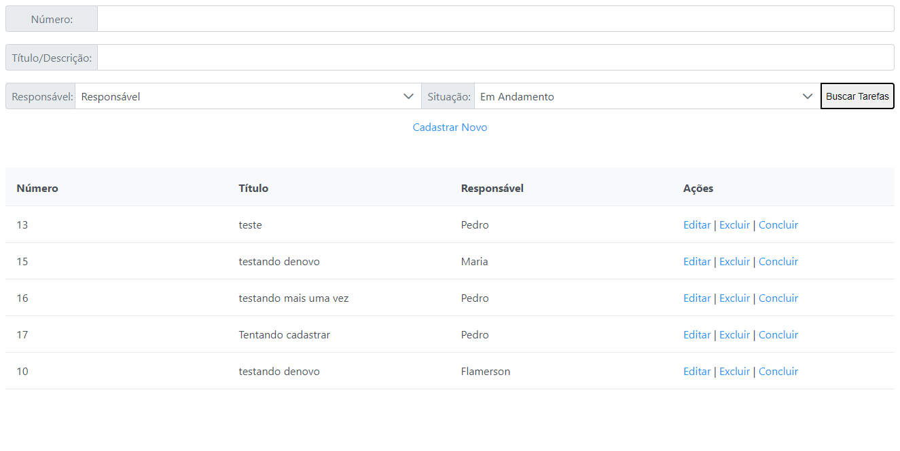
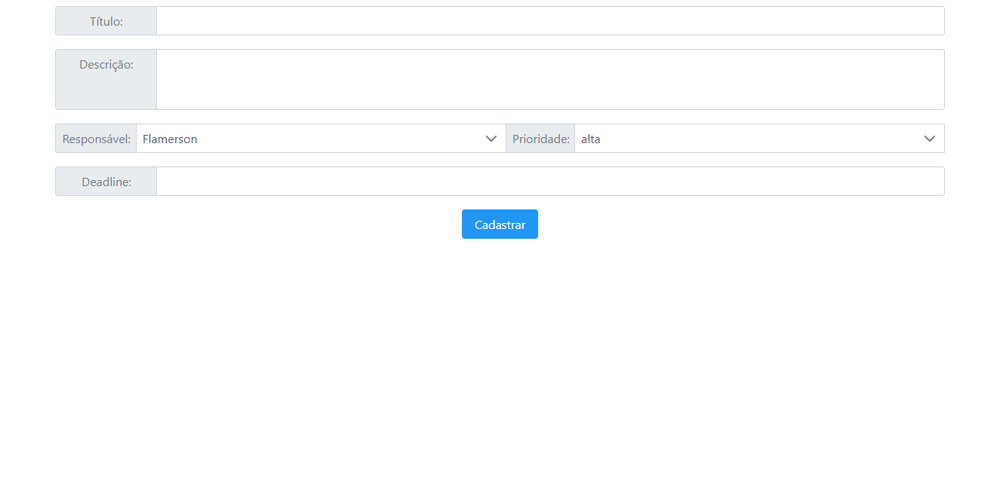
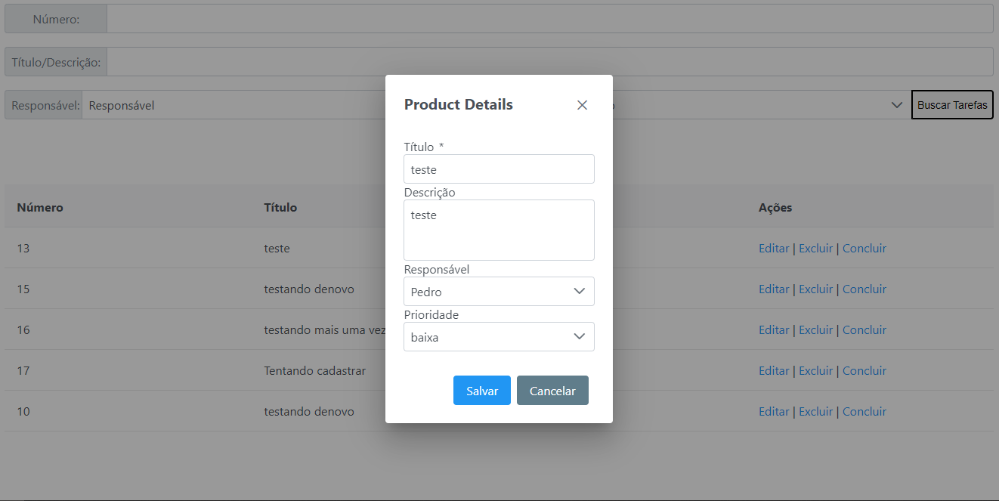
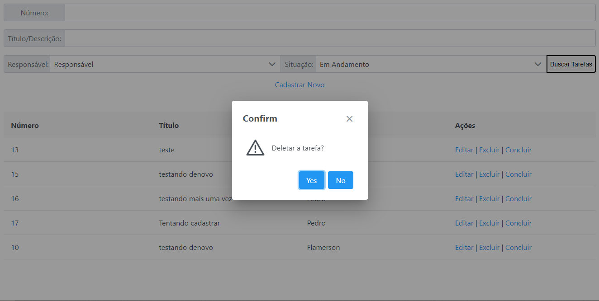
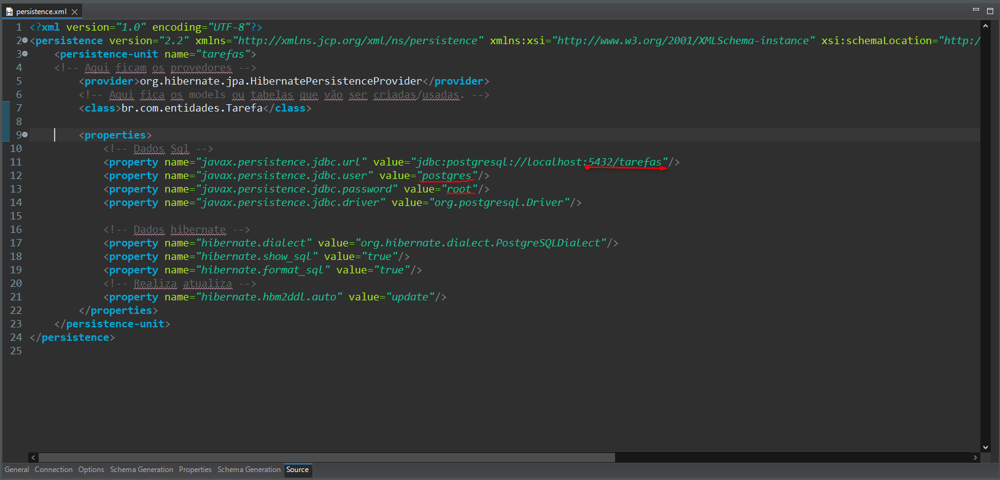

# Tarefas

Seja bem vindo ao meu projeto para a Esig, esse projeto consiste em um gerenciamento de tarefas com persistência no banco de dados, criado em Java, utilizando algumas bibliotecas bem legais de lidar.

## Bibliotecas utilizadas

Foi solicitado o uso de Java Web utilizando o JavaServer Faces(JSF), utilizei o JavaPrime Faces(JPF) para deixar com um estilo mais agradável, também utilizado o Jpa para a persistência em banco junto com o Hibernate.

## Breve apresentação do produto

Como solicitado foi criado duas páginas, uma com a listagem e filtragem, outra com cadastro.

Na página inicial decidi utilizar a de listar e filtrar como pode ver abaixo.

Já na página de cadastro decidi colocar alguns elementos do JPF para deixar mais visual.

Voltando a página inicial vemos que existem três botões, cada um chama para um evento, esses eventos são, Editar, Deletar e Concluir.  
O evento de editar ficou da seguinte forma. 

Podendo verificar que se pode editar alguns campos que achei que seriam os que estão livres para edição após essa tarefa está no banco.

Já o evento deletar decidi que o mesmo iria chamar um Pop-up com uma pergunta se deve ou não ser deletado do banco.

No evento concluir também utilizei o mesmo Pop-up com um texto diferente, gostei bastante desse pop-up interativo.

## Orientações

Se gostou e deseja ver no seu computador o programa rodando você precisa se atentar a algumas configurações.  
No arquivo (persistence.xml) que encontrasse no caminho : ./src/main/java/META-INF  
É necessário alterar algumas linhas para conseguir utilizá-las no seu projeto.
- Na linha 11 do arquivo é necessário alterar o value para o localhost do seu banco e o nome da table que irá utilizar.
- Na linha 12 também no value é preciso mudar para o seu usuário do banco.
- Na linha 13 também precisa mudar o value para sua senha do banco.
- Realizar a criação da tabela no banco de dados para que o aplicativo reconheça.

Pode verificar o sublinhado na imagem abaixo.

Caso utilize Mysql é preciso realizar outras alterações nesse arquivo como o drive na linha 14 e o dialeto na linha 17, e também trazer a dependência no arquivo pom.xml

Observe que o banco utilizado foi o PostgreSQL na versão mais recente.  
O servidor utilizado para os testes foi o Tomcat na versão 9.0 e a Ide Eclipse.

## Observações finais

Caso tenha gostado do arquivo e apresentação você pode entrar em contato comigo no instagram ou linkedin, para tirar dúvidas, deixa uma estrelinha no repositório para eu saber que gostou.
